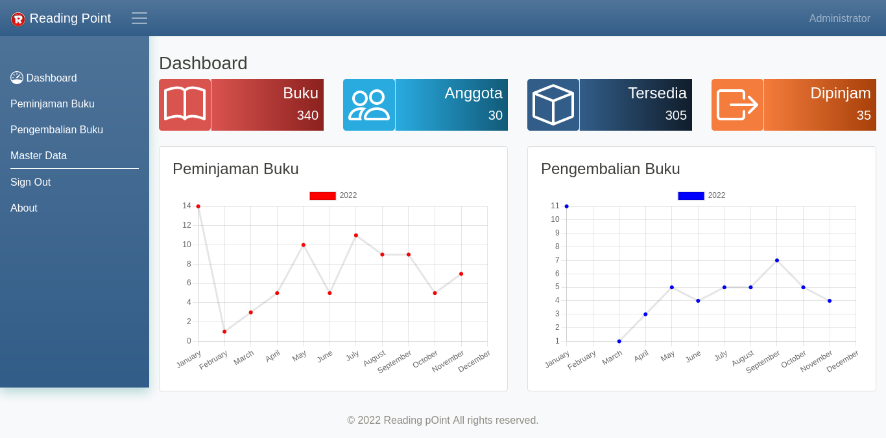

# Reading Point Project

Reading point adalah aplikasi yang dibangun berdasarkan arsitektur microservice dan terdiri dari 4 services  dan 1 client. Project ini dibuat sebagai bahan kajian untuk materi kuliah Pengantar Microservice di Unpri Medan.

Berikut ini adalah cara deployment di Ubuntu WSL.

## Software Requirements 

- Ubuntu WSL versi 20 atau terbaru
- Docker Desktop
- npm
- Vue-cli 

## Menyiapkan Environment

Pastikan di host telah tersedia npm dan vue-cli

Untuk mengecek apakah npm telah terinstall jalankan:

```bash
npm --version
```

Untuk melihat apakah vue-cli telah terinstall, jalankan:

```bash
vue --version
```


## Clone the repo

```bash
$ git clone --recursive https://github.com/ezra-dalimunthe/ReadingPointProject.git
$ cd ReadingPointProject
$ chmod +x install.sh
$ chmod +x checkdb.sh
$ chmod +x setup-app.sh
$ chmod +x uninstall.sh
```

## Menjalankan instalasi 

Pada root terdapat file `install.sh` file ini berisi perintah-perintah untuk membuat aplikasi berjalan pada docker container. Eksekusi file tersebut.

```bash
./install.sh
```

Setelah eksekusi berakhir, akan terlihat bahwa semua aplikasi service telah berjalan. Namun hal itu belum lengkap karena database belum berisi tabel-tabel yang dibutuhkan.

## Setup database table

Sebelum melakukan setup table untuk tiap database, check terlebih dahulu apakah container yang bertindak sebagai database telah berjalan.


```bash
./checkdb.sh
```

Bila belum berjalan, tunggu beberapa saat dan jalankan lagi perintah `checkdb.sh` tersebut. Ini karena adakalanya container yang menjalankan mariadb memerlukan waktu untuk menjalankan servicenya.

```
Check Database for AuthService: 
database reading_point_auth is ready

Check Database for Book Service: 
database reading_point_book is ready

Check Database for Member Service: 
database reading_point_member is ready

Check Database for Borrow Service: 
database reading_point_borrow is ready

```

Bila telah berjalan, eksekusi file setup-app.sh

```bash
./setup-app.sh
```

## Hasil akhir

Hasil akhir akan terlihat pada Docker desktop dengan container-container yang berjalan seperti pada tabel di bawah ini


<table>
    <thead>
      <tr>
        <th title="name">NAMES</th>
        <th title="ports">PORTS</th>
        <th title="networks">NETWORKS</th>
      </tr>
    </thead>
    <tbody>
      <tr>
        <td>AuthService</td>
        <td></td>
        <td></td>
      </tr>
      <tr>
        <td>reading-point-auth-app-service</td>
        <td>
            - 9000/tcp<br>
            - 0.0.0.0:8901-&gt;8000/tcp<br>
            - :::8901-&gt;8000/tcp
        </td>
        <td>reading-point-auth-network</td>
      </tr>
      <tr>
        <td>reading-point-auth-db-service</td>
        <td>- 3306/tcp</td>
        <td>- reading-point-auth-network</td>
      </tr>
      <tr>
        <td>reading-point-auth-redis-service</td>
        <td>- 6379/tcp</td>
        <td>- reading-point-auth-network</td>
      </tr>
        <tr>
        <td >BookService</td>
        <td></td>
        <td></td>
      </tr>
      <tr>
        <td>reading-point-book-app-service
        </td>
        <td>
            - 9000/tcp<br>
            - 0.0.0.0:8902-&gt;8000/tcp<br>
            - :::8901-&gt;8000/tcp          
        </td>
        <td>
            - reading-point-auth-network<br>
            - reading-point-book-network<br>
        </td>
      </tr>
      <tr>
        <td>reading-point-book-db-service</td>
        <td>- 3306/tcp</td>
        <td>reading-point-book-network</td>
      </tr>
      <tr>
        <td>reading-point-book-redis-service</td>
        <td>- 6379/tcp</td>
        <td>- reading-point-book-network</td>
      </tr>
      <tr>
        <td >MemberService</td>
        <td></td>
        <td></td>
      </tr>
      <tr>
        <td>reading-point-member-app-service</td>
        <td>
            - 9000/tcp<br>
            - 0.0.0.0:8903-&gt;8000/tcp<br>
            - :::8903-&gt;8000/tcp          
        </td>
        <td>
            - reading-point-auth-network<br>
            - reading-point-member-network<br>
        </td>
      </tr>
      <tr>
        <td>reading-point-member-db-service</td>
        <td>- 3306/tcp</td>
        <td>- reading-point-member-network</td>
      </tr>
      <tr>
        <td>reading-point-member-redis-service</td>
        <td>- 6379/tcp</td>
        <td>- reading-point-member-network</td>
      </tr>
      <tr>
        <td >BorrowService</td>
        <td></td>
        <td></td>
      </tr>
      <tr>
        <td>reading-point-borrow-app-service</td>
        <td>          
            - 9000/tcp<br>
            - 0.0.0.0:8904-&gt;8000/tcp<br>
            - :::8904-&gt;8000/tcp          
        </td>
        <td>
          - reading-point-auth-network<br>
          - reading-point-member-network<br>
          - reading-point-book-network<br>
          - reading-point-borrow-network<br>
        </td>
      </tr>
      <tr>
        <td>reading-point-borrow-db-service</td>
        <td>- 3306/tcp</td>
        <td>- reading-point-borrow-network</td>
      </tr>
      <tr>
        <td>reading-point-member-redis-service</td>
        <td>- 6379/tcp</td>
        <td>- reading-point-member-network</td>
      </tr>
      <tr>
        <td >ReadingPointWebFrontEnd</td>
        <td></td>
        <td></td>
      </tr>
      <tr>
        <td>reading-point-frontend</td>
        <td>- 80/tcp<br>
        - 0.0.0.0:8900->8000/tcp<br>
        - :::8900->8000/tcp</td>
        <td>- reading-point-frontend-network</td>
      </tr>
    </tbody>
  </table>


## Membuka aplikasi

Jalankan browser dan arahkan ke http://127.0.0.1:8900 

Ada 4 user yang ditambahkan pada aplikasi ini [lihat file DatabaseSeeder.php untuk AuthService](https://github.com/ezra-dalimunthe/AuthService/blob/6a99b4a290d886bdb3b94d3788fcf0116babe712/database/seeders/DatabaseSeeder.php)

|Username| Password | Role|
|-|-|-|
|admin@example.com|secret123|administrator, front_desk, book_manager, member_manager|
|front_desk@example.com|secret123|front_desk|
|book_manager@example.com|secret123|book_manager|
|member_manager@example.com|secret123|member_manager|

Tampilan pada Reading Point client akan berbeda untuk tiap user yang login. 

